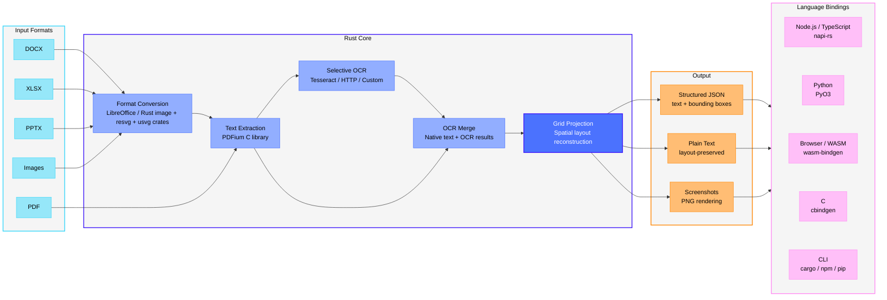

# LiteParse

[](https://github.com/run-llama/liteparse/actions/workflows/ci.yml)
|
[](https://crates.io/crates/liteparse)
|
[](https://www.npmjs.com/package/@llamaindex/liteparse)
|
[](https://www.npmjs.com/package/@llamaindex/liteparse-wasm)
|
[](https://pypi.org/project/liteparse/)
|
[](https://opensource.org/licenses/Apache-2.0)
|
[Docs](https://developers.llamaindex.ai/liteparse/)

English | [简体中文](README.zh-CN.md)


> Looking for LiteParse V1? Follow this link to [the old code](https://github.com/run-llama/liteparse/tree/logan/liteparse-v1)

LiteParse is a standalone OSS PDF parsing tool focused exclusively on **fast and light** parsing. It provides high-quality spatial text parsing with bounding boxes, without proprietary LLM features or cloud dependencies. Everything runs locally on your machine.

**Hitting the limits of local parsing?**
For complex documents (dense tables, multi-column layouts, charts, handwritten text, or
scanned PDFs), you'll get significantly better results with [LlamaParse](https://developers.llamaindex.ai/python/cloud/llamaparse/?utm_source=github&utm_medium=liteparse),
our cloud-based document parser built for production document pipelines. LlamaParse handles the
hard stuff so your models see clean, structured data and markdown.

>  [Sign up for LlamaParse free](https://cloud.llamaindex.ai?utm_source=github&utm_medium=liteparse)

## Overview

- **Fast Text Parsing**: Spatial text parsing using PDFium
- **Flexible OCR System**:
  - **Built-in**: Tesseract (zero setup, bundled with the library)
  - **HTTP Servers**: Plug in any OCR server (EasyOCR, PaddleOCR, custom)
  - **Standard API**: Simple, well-defined OCR API specification
- **Complexity Detection**: Cheaply check whether a document needs OCR or heavier parsing — route, reject, or estimate cost before a full parse
- **Screenshot Generation**: Generate high-quality page screenshots for LLM agents
- **Multiple Output Formats**: Markdown, JSON, and Text
- **Markdown Output**: Structured Markdown with headings, tables, lists, images, and links — great for feeding LLMs and RAG pipelines
- **Bounding Boxes**: Precise text positioning information
- **Multi-language**: Use from Rust, C, Node.js/TypeScript, Python, or the browser (WASM)
- **Multi-platform**: Linux, macOS (Intel/ARM), Windows



## Installation

Install via your preferred package manager. The Rust, Node.js, and Python distributions ship with the same `lit` CLI.

| Language | Install | Library Docs |
|----------|---------|--------------|
| **Node.js / TypeScript** | `npm i -g @llamaindex/liteparse` | [Node.js README](packages/node/README.md) |
| **Python** | `pip install liteparse` | [Python README](packages/python/README.md) |
| **Rust** | `cargo install liteparse` (CLI) / `cargo add liteparse` (lib) | [Rust README (crates.io)](crates/liteparse/README.md) |
| **C** | Build `liteparse-c` from source | [C bindings README](crates/liteparse-c/README.md) |
| **Browser (WASM)** | `npm i @llamaindex/liteparse-wasm` | [WASM README](packages/wasm/README.md) |

### Agent Skill

You can use `liteparse` as an agent skill, downloading it with the `skills` CLI tool:

```bash
npx skills add run-llama/llamaparse-agent-skills --skill liteparse
```

Or copy-pasting the [`SKILL.md`](https://github.com/run-llama/llamaparse-agent-skills/blob/main/skills/liteparse/SKILL.md) file to your own skills setup.

See the [Agent Skill guide](https://developers.llamaindex.ai/liteparse/guides/agent-skill/?utm_source=github&utm_medium=liteparse) for requirements and usage patterns.

## CLI Usage

The CLI is the same across all installations (`npm`, `pip`, `cargo install`).

### Parse Files

```bash
# Basic parsing
lit parse document.pdf

# Parse to Markdown — headings, tables, lists, images, links
lit parse document.pdf --format markdown -o output.md

# Parse with specific format
lit parse document.pdf --format json -o output.json

# Parse specific pages
lit parse document.pdf --target-pages "1-5,10,15-20"

# Parse without OCR
lit parse document.pdf --no-ocr

# Include page-scoped vector path data in JSON
lit parse document.pdf --format json --extract-vector-graphics

# Include rich per-item PDF text metadata
lit parse document.pdf --format json --extract-text-metadata

# Include page annotations in structured JSON
lit parse document.pdf --format json --extract-annotations

# Include AcroForm widget fields and values (repairs orphaned widgets in memory)
lit parse document.pdf --format json --extract-form-fields

# Parse a remote PDF
curl -sL https://example.com/report.pdf | lit parse -
```

### Markdown Output

LiteParse can render documents directly to Markdown. This means reconstructing headings,
tables, lists, images, and links from the spatial layout. This is ideal for
feeding documents to LLMs and RAG pipelines. This mode is purely heuristics and rule-based,
so complex documents may not render perfectly, but it will be fast.

```bash
# Render to Markdown
lit parse document.pdf --format markdown -o output.md

# Strip images instead of emitting placeholders
lit parse document.pdf --format markdown --image-mode off

# Extract embedded images to disk and reference them from the markdown
lit parse document.pdf --format markdown --image-mode embed --extract-images --image-output-dir ./images

# Extract image bytes and metadata without changing Markdown image handling
lit parse document.pdf --format json --extract-images

# Emit link text as plain text (no [text](url) syntax)
lit parse document.pdf --format markdown --no-links

# Include tagged-PDF logical structure in JSON
lit parse document.pdf --format json --extract-structure-tree

# Include the classified layout blocks (with bounding boxes) in JSON
lit parse document.pdf --format json --extract-blocks
```

Image handling is controlled by `--image-mode`:

| Mode | Behavior |
|------|----------|
| `placeholder` (default) | Emits `` references in reading order |
| `off` | Strips images entirely |
| `embed` | Emits the same image references as `placeholder` |

`--extract-images` is the only option that enables embedded-image extraction.
`--image-output-dir` requires it and writes the extracted bytes to disk. JSON output
contains each image's `name`, `path`, page bbox, intrinsic pixel dimensions, rotation,
format, and duplicate relationship; pixel bytes are never embedded in JSON. Identical
image resources reuse the same output file.

Library callers can opt in with `extract_images: true` (Rust), `extractImages: true`
(Node/WASM), or `extract_images=True` (Python). It defaults to false. Markdown image
mode controls presentation only; placeholder refs are still discovered without bytes.

> Markdown reconstruction quality varies with document complexity. For the
> hardest documents (dense tables, multi-column layouts, scans),
> [LlamaParse](https://developers.llamaindex.ai/python/cloud/llamaparse/?utm_source=github&utm_medium=liteparse)
> remains the most accurate option.

### Vector Graphics

Vector path output is opt-in because path-heavy PDFs can produce large payloads.
Enable it with `--extract-vector-graphics`, Rust/Python
`extract_vector_graphics = true`, or JavaScript/WASM
`extractVectorGraphics: true`. Each page then includes `vector_graphics`
(`vectorGraphics` in JavaScript) with:

- `shapes`: path bounding box, stroke/fill paint state and ARGB colors, and
  whether the path contains a Bezier curve.
- `lines`: compatible horizontal/vertical segments merged using stroke width
  and paint colors, with top-left 72-DPI viewport coordinates.

The representation follows LlamaParse PDFium path extraction; LiteParse calls
the shape rectangle `bbox` rather than PDFium's `coords`, and uses `width` /
`height` rather than `w` / `h`. The field is absent (or `None`/`undefined`) by
default. Diagonal and curved segments are represented by their parent shape but
are not emitted as lines.

### Tagged PDF structure tree

Enable `--extract-structure-tree` (Rust/Python `extract_structure_tree`,
JavaScript/WASM `extractStructureTree`) to add a page-scoped `structure_tree`.
It preserves every root and recursively exposes element type, ID, actual/alternate
text, title, typed scalar attributes, marked-content IDs, children, and referenced
link annotations. The field is absent by default; enabled untagged pages contain
`roots: []`.

### Layout blocks

The Markdown renderer works by classifying each page into blocks — headings,
paragraphs, list items, tables, code, rules, figures — and then rendering them.
Enable `--extract-blocks` (Rust/Python `extract_blocks`, JavaScript/WASM
`extractBlocks`) to get that decomposition as data instead of only as rendered
text, with the coordinates the classifier used.

Each page gains a `blocks` array in reading order — the same order, and the same
blocks, the Markdown output is built from. Every block carries:

- `kind`: one of `heading`, `paragraph`, `list_item`, `code`, `table`,
  `grid_fallback`, `rule`, `figure`.
- `bbox`: the region it occupies, in the same top-left 72-DPI viewport space as
  `text_items`. This is the union of every source line that fed the block, so a
  wrapped heading or a multi-line paragraph reports its whole band.
- Kind-specific fields, omitted when they don't apply: `text` and `level` for
  headings; `ordered` / `marker` for list items; `lines` and `lang` for code;
  `header` and `rows` for tables; `id` / `format` for figures.

Table cells are objects, not bare strings — each has `text` and its own `bbox`,
so a cell can be mapped back to the region of the page it was read from. For
ruled tables that box is the drawn grid cell; for borderless tables it is the
extent of the spans the cell was built from. Cells that exist only to square off
a ragged grid carry no `bbox`, since they have no ink behind them.

```json
{
  "kind": "table",
  "bbox": { "x": 72.0, "y": 310.5, "width": 468.0, "height": 96.0 },
  "header": [
    { "text": "Territory Code", "bbox": { "x": 72.0, "y": 310.5, "width": 120.0, "height": 24.0 } },
    { "text": "Factor",         "bbox": { "x": 192.0, "y": 310.5, "width": 96.0, "height": 24.0 } }
  ],
  "rows": [
    [
      { "text": "001", "bbox": { "x": 72.0, "y": 334.5, "width": 120.0, "height": 24.0 } },
      { "text": "1.25", "bbox": { "x": 192.0, "y": 334.5, "width": 96.0, "height": 24.0 } }
    ]
  ]
}
```

### Document metadata, content bounds, and XFA packets

Parse results (Rust/Node/Python APIs) carry the document's `/Info` `creator`
and `producer` entries when present; these are API-only and never appear in
CLI JSON output. Enable `extract_document_metadata` (JavaScript/WASM
`extractDocumentMetadata`) to add `doc_meta`/`docMeta`, a provenance object
with the `/Info` creation/modification dates, PDF version and encryption
permissions, signature state, incremental-save markers, trailer ID comparison,
the document catalog's XMP packet (capped at 64 KiB, with `xmp_truncated`
when it was cut), and source file size. It is off by default because it
streams the whole source file once; it is absent for inputs converted from a
non-PDF format, where the facts would describe the intermediate PDF rather
than your file. `xmp` needs a structural parse of the document, so it is
skipped (left absent) for sources over 16 MiB and in WASM builds — the other
fields are unaffected.
Enable `--extract-content-bounds` (Rust/Python
`extract_content_bounds`, JavaScript/WASM `extractContentBounds`) to add a
per-page `content_bounds`: the union bbox of the page's top-level content
objects in viewport coords (absent for empty pages). Enable
`--extract-xfa-packets` (Rust/Python `extract_xfa_packets`, JavaScript/WASM
`extractXfaPackets`) to add `xfa_packets` with each raw XFA packet's index,
name, byte length, and XML content; non-XFA documents yield an empty list.
All of these are off by default, so default JSON output is unchanged.

### Screenshot raster signals

Screenshots draw AcroForm field appearances (filled values, checkbox states)
on top of the page raster, so form data is visible in the render and to OCR.
Each screenshot result reports `is_solid_fill` (blank page after render), and
with `detect_screenshot_rects` (Node `detectScreenshotRects`) also `rects`:
solid same-color rectangles and lines found in the raster in viewport coords,
which covers scanned/flattened pages that carry no vector paths.

### Check Complexity

Before committing to a full parse, check whether a document actually needs OCR or
heavier processing. This is a cheap, text-layer-only pass — useful for routing
documents to different pipelines, rejecting ones you can't handle, or estimating cost.

```bash
# Print the complexity verdict and per-page JSON
lit is-complex document.pdf

# Use as a shell predicate — only parse with --no-ocr when the document is simple
lit is-complex document.pdf --quiet && lit parse document.pdf --no-ocr

# List the pages that need OCR
lit is-complex document.pdf --compact | jq '[.[] | select(.needs_ocr) | .page_number]'
```

It always prints per-page JSON to **stdout**, a human-readable verdict to **stderr**, and
exits **non-zero when any page needs OCR**. Each page carries a `needs_ocr` verdict and a
list of `reasons` (`scanned`, `no-text`, `sparse-text`, `embedded-images`, `garbled`,
`vector-text`, `annotation-text`).

### Batch Parsing

Parse an entire directory of documents:

```bash
lit batch-parse ./input-directory ./output-directory
```

### Generate Screenshots

Screenshots are essential for LLM agents to extract visual information that text alone cannot capture.

```bash
# Screenshot all pages
lit screenshot document.pdf -o ./screenshots

# Screenshot specific pages
lit screenshot document.pdf --target-pages "1,3,5" -o ./screenshots

# Custom DPI
lit screenshot document.pdf --dpi 300 -o ./screenshots
```

### CLI Reference

#### Parse Command

```
lit parse [OPTIONS] <file>

Options:
  -o, --output <file>          Output file path
      --format <format>        Output format: json|text|markdown [default: text]
      --no-ocr                 Disable OCR
      --ocr-language <lang>    OCR language, Tesseract format [default: eng]
      --ocr-server-url <url>   HTTP OCR server URL (uses Tesseract if not provided)
      --tessdata-path <path>   Path to tessdata directory
      --max-pages <n>          Max pages to parse [default: 1000]
      --target-pages <pages>   Pages to parse (e.g., "1-5,10,15-20")
      --dpi <dpi>              Rendering DPI [default: 150]
      --image-mode <mode>      Markdown image handling: off|placeholder|embed [default: placeholder]
      --extract-images         Extract embedded image bytes and metadata
      --image-output-dir <dir> Write extracted images; requires --extract-images
      --extract-text-metadata  Include rich PDF text metadata in text items
      --extract-vector-graphics Include page vector shapes and merged H/V lines
      --no-links               Emit link anchor text as plain text (no [text](url)) in markdown
      --keep-headers-footers   Keep running headers/footers in markdown (skip repeated-line stripping)
      --extract-annotations    Include PDF annotations in page output
      --extract-form-fields    Include AcroForm widget fields and values
      --preserve-small-text    Keep very small text
      --password <password>    Password for encrypted documents
      --num-workers <n>        Concurrent OCR workers [default: CPU cores - 1]
  -q, --quiet                  Suppress progress output
  -h, --help                   Print help
```

#### Batch Parse Command

```
lit batch-parse [OPTIONS] <input-dir> <output-dir>

Options:
      --format <format>        Output format: json|text|markdown [default: text]
      --no-ocr                 Disable OCR
      --ocr-language <lang>    OCR language [default: eng]
      --ocr-server-url <url>   HTTP OCR server URL
      --tessdata-path <path>   Path to tessdata directory
      --max-pages <n>          Max pages per file [default: 1000]
      --dpi <dpi>              Rendering DPI [default: 150]
      --recursive              Recursively search input directory
      --extension <ext>        Only process files with this extension (e.g., ".pdf")
      --password <password>    Password for encrypted documents
      --num-workers <n>        Concurrent OCR workers
  -q, --quiet                  Suppress progress output
  -h, --help                   Print help
```

#### Screenshot Command

```
lit screenshot [OPTIONS] <file>

Options:
  -o, --output-dir <dir>       Output directory [default: ./screenshots]
      --target-pages <pages>   Pages to screenshot (e.g., "1,3,5" or "1-5")
      --dpi <dpi>              Rendering DPI [default: 150]
      --password <password>    Password for encrypted documents
  -q, --quiet                  Suppress progress output
  -h, --help                   Print help
```

#### Is-Complex Command

```
lit is-complex [OPTIONS] <file>

Options:
      --compact                Emit dense, whitespace-free JSON instead of pretty-printed
      --max-pages <n>          Max pages to check [default: 1000]
      --target-pages <pages>   Pages to check (e.g., "1-5,10,15-20")
      --password <password>    Password for encrypted documents
  -q, --quiet                  Suppress the stderr verdict
  -h, --help                   Print help
```

Prints per-page JSON to stdout and a `COMPLEX`/`SIMPLE` verdict to stderr; exits non-zero
when any page needs OCR, so it composes as a shell predicate.

## OCR Setup

### Default: Tesseract

Tesseract is bundled and works out of the box:

```bash
lit parse document.pdf                    # OCR enabled by default
lit parse document.pdf --ocr-language fra # Specify language
lit parse document.pdf --no-ocr           # Disable OCR
```

For offline or air-gapped environments, set `TESSDATA_PREFIX` to a directory containing pre-downloaded `.traineddata` files:

```bash
export TESSDATA_PREFIX=/path/to/tessdata
lit parse document.pdf --ocr-language eng
```

Or pass the path directly:

```bash
lit parse document.pdf --tessdata-path /path/to/tessdata
```

### Optional: HTTP OCR Servers

For higher accuracy or better performance, you can use an HTTP OCR server. We provide ready-to-use example wrappers for popular OCR engines:

- [EasyOCR](ocr/easyocr/README.md)
- [PaddleOCR](ocr/paddleocr/README.md)

You can integrate any OCR service by implementing the simple LiteParse OCR API specification (see [`OCR_API_SPEC.md`](OCR_API_SPEC.md)).

The API requires:
- POST `/ocr` endpoint
- Accepts `file` and `language` parameters
- Returns JSON: `{ results: [{ text, bbox: [x1,y1,x2,y2], confidence }] }`

## Multi-Format Input Support

LiteParse supports **automatic conversion** of various document formats to PDF before parsing.

### Supported Input Formats

#### Office Documents (via LibreOffice)
- **Word**: `.doc`, `.docx`, `.docm`, `.odt`, `.rtf`, `.pages`
- **PowerPoint**: `.ppt`, `.pptx`, `.pptm`, `.odp`, `.key`
- **Spreadsheets**: `.xls`, `.xlsx`, `.xlsm`, `.ods`, `.csv`, `.tsv`, `.numbers`

Install LibreOffice for automatic conversion:

```bash
# macOS
brew install --cask libreoffice

# Ubuntu/Debian
apt-get install libreoffice

# Windows
choco install libreoffice-fresh
```

> _On Windows, you may need to add LibreOffice's program directory (usually `C:\Program Files\LibreOffice\program`) to your PATH._

#### Images (native support)
- **Formats**: `.jpg`, `.jpeg`, `.png`, `.gif`, `.bmp`, `.tiff`, `.webp`, `.svg`

> ![NOTE]
>
> As of [v2.8.0](https://github.com/run-llama/liteparse/releases/tag/crates-v2.8.0), `imagemagick` is no longer required to convert images to PDF. Conversion is natively
> handled by the rust code.

## Environment Variables

| Variable | Description |
|----------|-------------|
| `TESSDATA_PREFIX` | Path to a directory containing Tesseract `.traineddata` files. Used for offline/air-gapped environments. |

## Development

The project is a Rust workspace with the core library and language-specific binding crates.

```
crates/
├── liteparse/          # Core library + CLI binary
├── liteparse-c/        # C ABI + generated header (cbindgen)
├── liteparse-napi/     # Node.js bindings (napi-rs)
├── liteparse-python/   # Python bindings (PyO3)
├── liteparse-wasm/     # WASM bindings (wasm-bindgen)
├── pdfium/             # PDFium Rust wrapper
└── pdfium-sys/         # PDFium FFI bindings
packages/
├── node/               # npm package (TS wrapper + native binary)
├── python/             # PyPI package (Python wrapper + native binary)
└── wasm/               # WASM npm package
```

### Building

```bash
# Build the CLI
cargo build --release -p liteparse

# Build the C dynamic/static libraries and regenerate the header
cargo build --release -p liteparse-c --no-default-features
make c-header

# Build Node.js bindings
cd packages/node && npm run build

# Build Python bindings
cd packages/python && maturin develop --release

# Build WASM
cd packages/wasm && npm run build
```

We provide a fairly rich `AGENTS.md`/`CLAUDE.md` that we recommend using to help with development + coding agents.

## License

Apache 2.0

## Credits

Built on top of:

- [PDFium](https://pdfium.googlesource.com/pdfium/) - PDF rendering and text extraction
- [Tesseract](https://github.com/tesseract-ocr/tesseract) - OCR engine (via tesseract-rs)
- [EasyOCR](https://github.com/JaidedAI/EasyOCR) - HTTP OCR server (optional)
- [PaddleOCR](https://github.com/PaddlePaddle/PaddleOCR) - HTTP OCR server (optional)
- [napi-rs](https://napi.rs/) - Node.js native bindings
- [PyO3](https://pyo3.rs/) - Python native bindings
- [wasm-bindgen](https://github.com/wasm-bindgen/wasm-bindgen) - WebAssembly bindings
